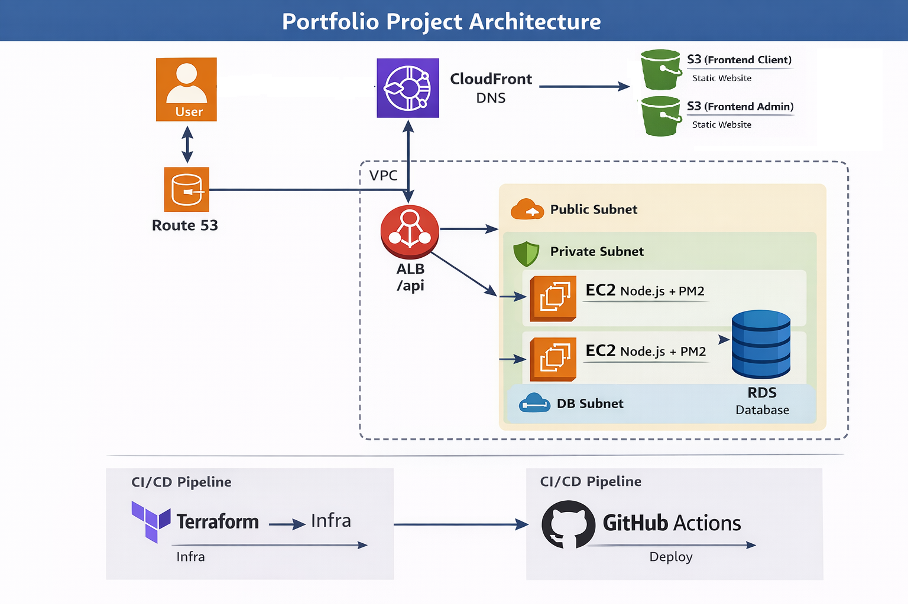
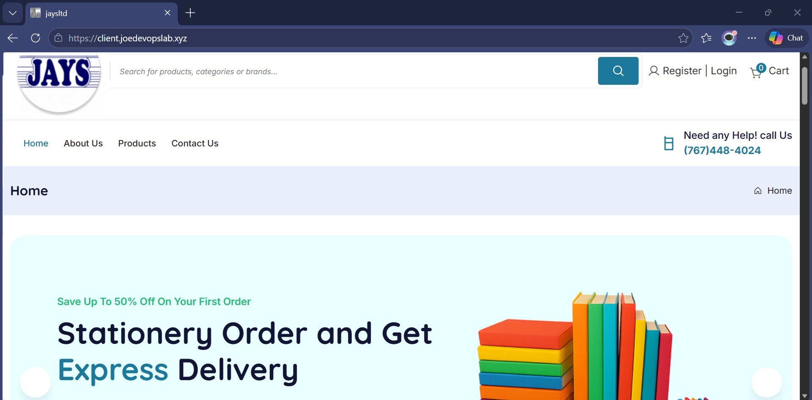
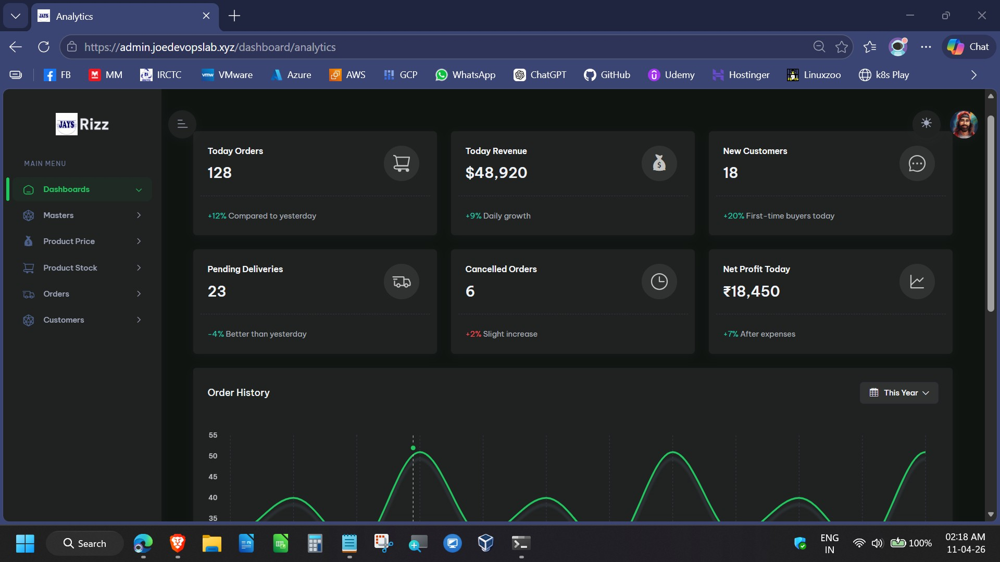
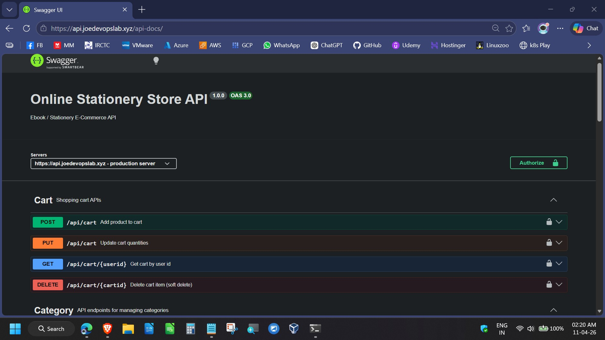

# 🚀 AWS Cloud-Native E-Commerce Platform

<p align="left">
  
  
  
  
  
  
</p>
A production-style, cloud-native e-commerce platform deployed on AWS using modern DevOps practices. This project demonstrates end-to-end infrastructure provisioning, CI/CD automation, and scalable application deployment.
---

## ⚡Quick Summary

* Built and deployed a **cloud-native e-commerce platform on AWS**
* Automated deployments using **GitHub Actions CI/CD**
* Deployed **frontend via S3 + CloudFront**
* Deployed **backend on EC2 with PM2**
* Integrated **PostgreSQL (RDS)**
* Solved **real-world infra/debugging issues (ALB, DNS, routing, deployment failures)**

---

# 🏗️ Architecture Overview



---

# ☁️ AWS Services Breakdown

| Service              | Purpose                                |
| -------------------- | -------------------------------------- |
| **EC2**              | Backend runtime (Node.js apps via PM2) |
| **ALB**              | Reverse proxy + routing                |
| **RDS (PostgreSQL)** | Persistent database                    |
| **S3**               | Static frontend hosting                |
| **CloudFront**       | CDN + caching                          |
| **Route53**          | Domain + DNS                           |
| **IAM**              | Access control                         |

---
# 📁 Repository Structure

```
.
├── ebook-client-fe/
├── ebook-admin-fe/
├── ebook-backend-api/
├── ebook-admin-be/
├── .gitignore
├── LICENSE
├── infra/terraform/
├── .github/workflows/
├── scripts/
└── docs
    ├── architecture/
    └── screenshots/
 
```

---

# 🚀 CI/CD Pipeline

### GitHub Actions Workflow

- ✔ Frontend deployment → S3
- ✔ CloudFront cache invalidation
- ✔ Backend deployment → EC2 via SSH
- ✔ PM2 restart (zero downtime style)

---

### Deployment Flow

```text
Git Push →
GitHub Actions →
SSH into EC2 →
Pull latest code →
Install dependencies →
Restart apps (PM2)
```

---

# 🖥️ Backend Runtime

* Node.js (Express)
* Managed using **PM2**
* Environment-based configuration
* Swagger API documentation enabled

---

# 🗄️ Database

* PostgreSQL (AWS RDS)
* Data restored via `pg_restore`
* Secure access via security groups

---

📸 Application Preview
🛍️ Customer Experience


🧑‍💼 Admin Dashboard


🔎 API Documentation


---

## 📸 Screenshots

> Stored in: `docs/screenshots/`

* Application UI
* Swagger API docs
* AWS Infrastructure
* CI/CD pipeline execution
* EC2 runtime (PM2 processes)

---


# ⚙️ Key Features

* ✅ Cloud-native architecture
* ✅ CI/CD automation
* ✅ CDN-backed frontend delivery
* ✅ Domain-based routing
* ✅ Production-style backend deployment
* ✅ Debugged real infra issues (DNS, ALB, userdata)

---

# 🧠 DevOps Highlights

* Infrastructure design (VPC, ALB, RDS)
* CI/CD automation
* Debugging production issues
* Environment variable management
* Cost optimization (single EC2 instead of ASG)

---

# 🏆 Outcome

This project demonstrates:

✔ End-to-end cloud deployment
✔ CI/CD pipeline design
✔ Real-world troubleshooting
✔ Production-style architecture

---

# 🔮 Future Enhancements

* 🔁 Auto Scaling Group (ASG)
* 🔐 HTTPS enforcement (ACM on ALB)
* 📊 Monitoring (CloudWatch / Prometheus)
* 🚀 Blue-Green deployments

---

# 👨‍💻 Author

**Joe**
DevOps Engineer

---

⭐ Final Note

This project reflects real-world DevOps practices, including troubleshooting complex deployment issues, implementing reliable CI/CD pipelines, and delivering a fully functional cloud-native application.

---
